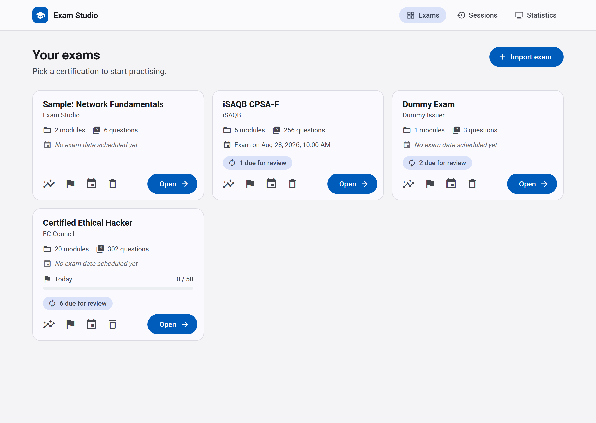
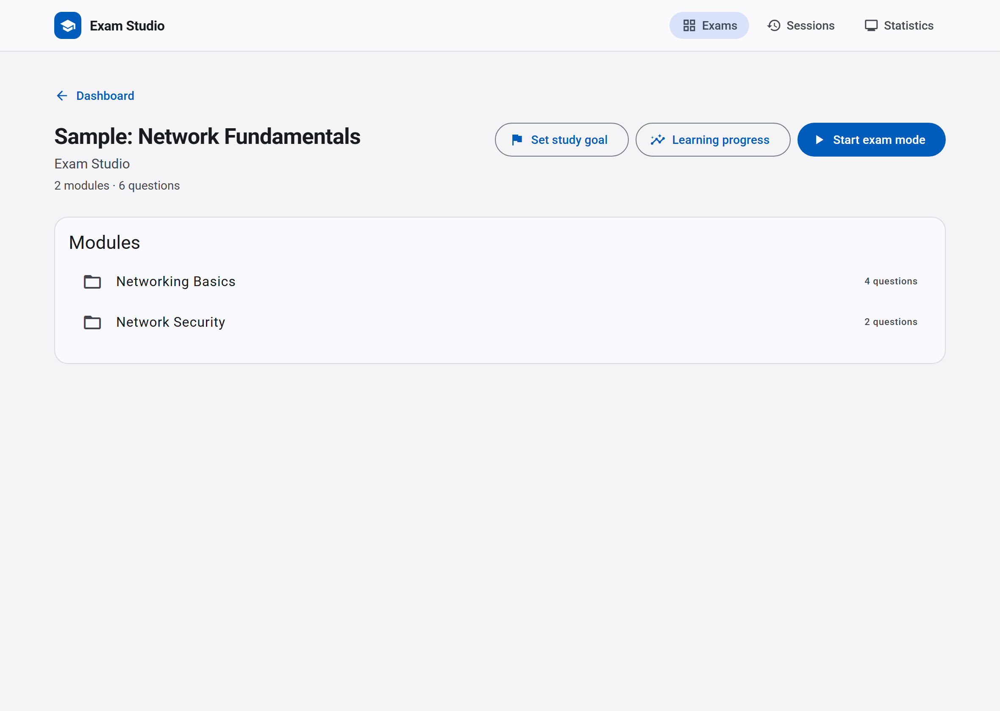
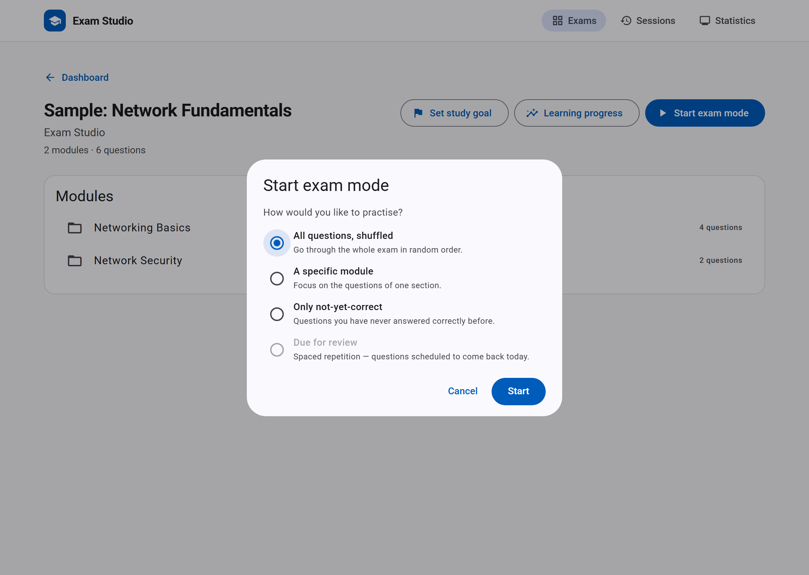
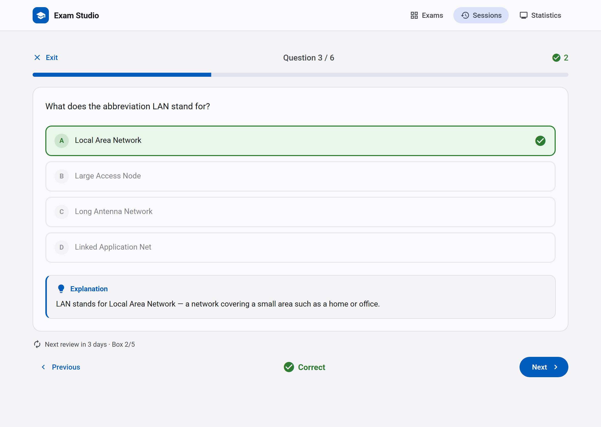
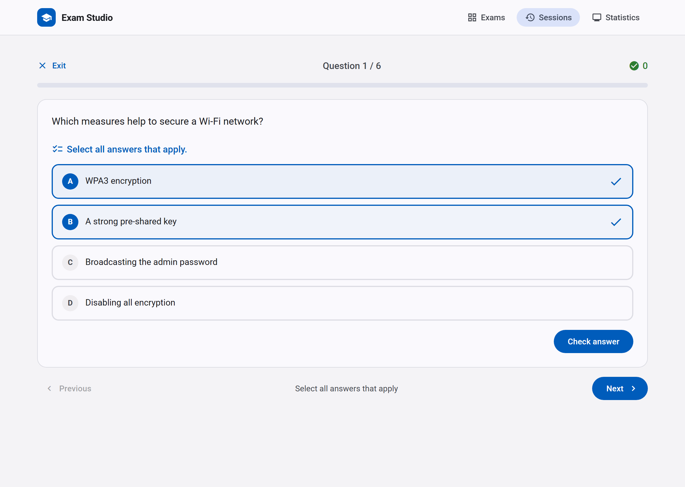
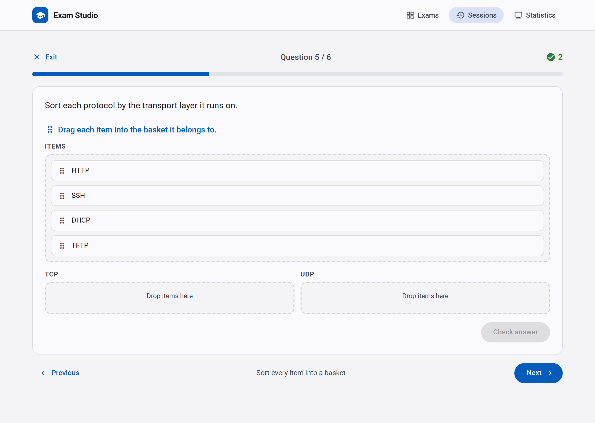
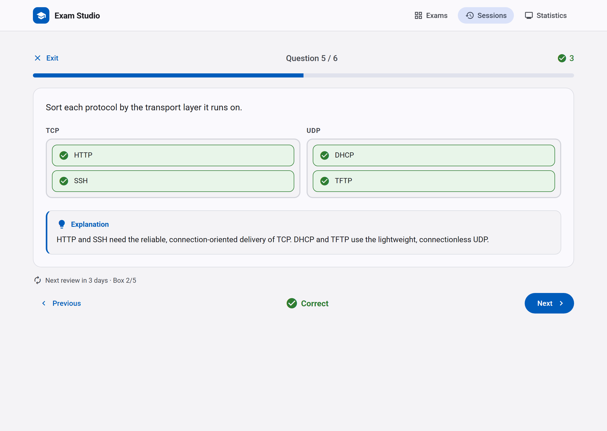
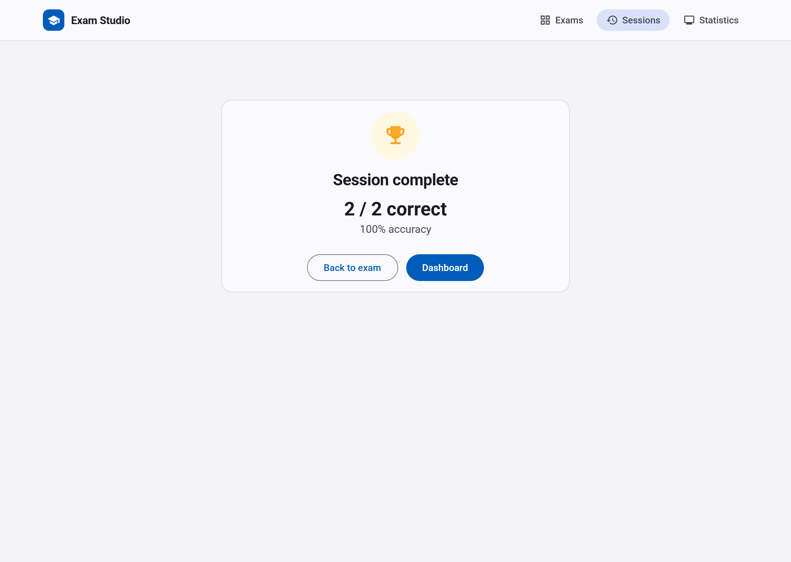
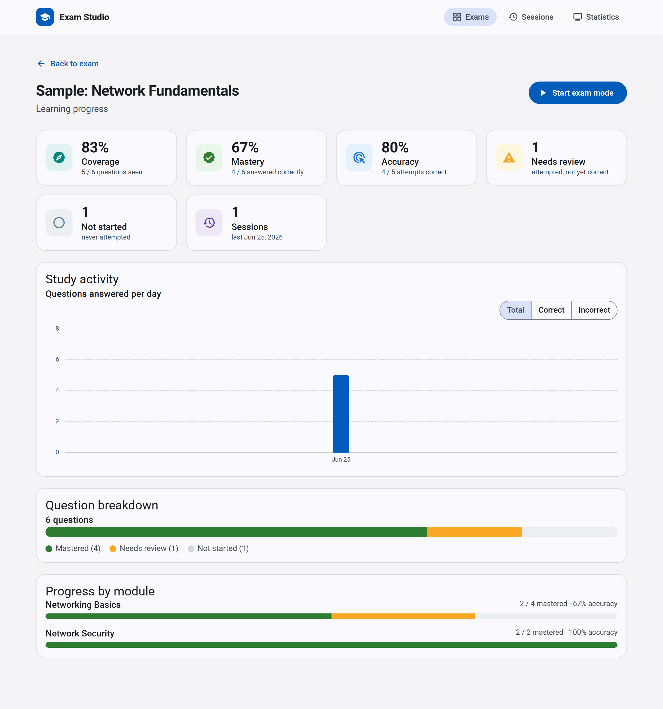

# Exam Studio

A small full-stack app for practising certification exams. Import an exam
(certification) as JSON, then run a question-by-question exam mode and have your
answers tracked in the database.

* **API** – FastAPI + GraphQL (Strawberry) + SQLAlchemy (async) + Alembic + PostgreSQL
* **Client** – Angular 22 (standalone, signals, zoneless) + Angular Material

## Screenshots

A quick visual tour of the app. The screenshots use the bundled sample exam —
import `exam.json` (Dashboard → **Import exam**) to reproduce it.

### Dashboard

Every certification at a glance: modules, question counts, the scheduled
certification exam date, daily/weekly study-goal progress and spaced-repetition
"due for review" badges.



### Exam overview & practice modes

| Exam detail — the modules and the launcher | Start exam mode — pick how to practise |
| --- | --- |
|  |  |

Practise **all questions shuffled**, a **single module**, **only not-yet-correct**
questions, or the questions whose **spaced-repetition review** is due today.

### Question types

Clicking an option submits it (and persists it in the database), then the answer
is graded instantly and the explanation plus the Leitner review schedule are
revealed.

| Single choice | Multiple choice — select all that apply |
| --- | --- |
|  |  |

| Allocation — drag each item into a basket | Allocation — per-item feedback after checking |
| --- | --- |
|  |  |

### Session summary & learning progress

When you finish a run you get a score summary, and each exam has a
learning-progress dashboard: coverage, mastery and accuracy, the
mastered / needs-review / not-started breakdown, a study-activity chart and a
per-module breakdown.

<p align="center">
  
</p>



```
exam-studio/
├── api/                 # Python GraphQL backend  (see api/README.md)
│   └── e2e/             # Playwright API tests    (see api/e2e/README.md)
├── client/              # Angular frontend        (see client/README.md)
│   └── e2e/             # Playwright E2E tests    (see client/e2e/README.md)
├── ci/                  # shared GitLab CI templates
├── .gitlab-ci.yml       # parent pipeline (triggers api/client child pipelines)
├── docker-compose.yml   # PostgreSQL for local dev
└── exam.json            # sample exam to import
```

## Domain model

```
Exam ──< Section ──< Question ──< Answer (flagged is_correct)
ExamSession ──< SessionItem ──< SessionItemAnswer (the chosen answers)
```

* An **Exam** is a certification (e.g. *Certified Ethical Hacker*).
* It is split into **Section**s (modules), each holding **Question**s.
* Each question has several **Answer**s; correct ones carry a boolean flag.
  A question is `single_choice` (exactly one correct answer),
  `multiple_choice` (one or more correct answers) or `allocation` (sort every
  item into one of the question's **categories** / baskets — the items are
  stored as answer rows that point at their correct category).
* Starting an exam snapshots an ordered **ExamSession** of **SessionItem**s.
  Every answer you give is persisted on its item.

## Authentication (Auth0)

Users sign in / register through **Auth0** (OpenID Connect). The SPA uses the
Authorization Code flow with PKCE and keeps tokens **in memory** with
refresh-token rotation. The API is an OAuth2 resource server that validates the
Bearer access token (RS256/JWKS), then scopes **every** exam and session to the
authenticated user.

Before the app works you must configure an Auth0 tenant and fill in the
placeholders:

* API (`.env`): `AUTH0_DOMAIN`, `AUTH0_AUDIENCE`.
* Client (`client/src/environments/environment*.ts`): `auth0.domain`,
  `auth0.clientId`, `auth0.audience` (audience must equal `AUTH0_AUDIENCE`).

Full step-by-step instructions: **[docs/auth0-setup.md](docs/auth0-setup.md)**.

> The migration adds a `users` table and a required `exams.user_id`. Existing
> exams are backfilled to a placeholder "legacy" user; re-import or reassign them
> once you have logged in. The Playwright suites require an access token after
> this change — see their READMEs.

## Run the whole stack with Docker

Build and start PostgreSQL, the API and the client together:

Duplicate `.env.example` to `.env` and seed with your custom configuration values

```bash
docker compose up --build
```

Then open the app at <http://localhost:8080>. nginx serves the Angular build and
reverse-proxies `/graphql` to the API (same origin, so no CORS). The API is also
reachable directly at <http://localhost:8000/graphql>. Database migrations
(`alembic upgrade head`) run automatically when the API container starts.

Stop everything with `docker compose down` (add `-v` to also drop the database
volume).

| Service | Image                        | Host port |
| ------- | ---------------------------- | --------- |
| client  | Angular build served by nginx | 8080      |
| api     | FastAPI / uvicorn             | 8000      |
| db      | PostgreSQL 16                 | 5432      |

## Quick start (local dev, without containers for the apps)

### 1. Database

```bash
docker compose up -d db
```

### 2. API

```bash
cd api
python3 -m venv .venv && source .venv/bin/activate   # Windows: .venv\Scripts\activate
pip install -r requirements.txt
cp .env.example .env
alembic upgrade head
uvicorn app.main:app --reload
```

API at <http://localhost:8000/graphql>.

### 3. Client

```bash
cd client
npm install
npm start
```

App at <http://localhost:4200>.

### 4. Try it

Open the app, click **Import exam**, choose `exam.json`, then open the
exam and **Start exam mode**.

See `api/README.md` for database-migration details and `client/README.md` for
the frontend structure.

## Testing

Both components have their own Playwright test project:

* **`api/e2e`** — black-box tests against the GraphQL API (no browser,
  Playwright request context only): import validation, session modes, answer
  semantics, statistics.
* **`client/e2e`** — browser E2E tests (Chromium) against the **production
  bundle**, served with the same `/graphql` proxying nginx does in the image.

Run them locally (details in the projects' READMEs):

```bash
docker compose up -d --build db api      # stack for both suites

cd api/e2e && npm ci && npm test         # API tests

cd client && npm run build               # bundle under test
cd e2e && npm ci && npm test             # client E2E tests
```

Each test seeds its own uniquely named exam through the API and cleans up
afterwards, so the suites are parallel-safe and repeatable against the same
database. A sample exam is seeded idempotently by the global setups.

## CI pipeline (GitLab)

The parent `.gitlab-ci.yml` triggers a child pipeline per component when its
files (or the shared `ci/` templates) change. Both child pipelines follow
*build once → test → release*:

| Stage     | api pipeline                            | client pipeline                          |
| --------- | --------------------------------------- | ---------------------------------------- |
| `build`   | build + push image `:$SHA`              | `ng build` artifact, build + push image `:$SHA` |
| `test`    | Playwright API tests **against the `:$SHA` image** | Playwright E2E against the built bundle + released API image |
| `release` | re-tag tested image as `:latest` (default branch) | same                                     |

In the test jobs the database is created from scratch: `postgres:16` runs as
a job service, the API service container applies the alembic migrations on
boot, and the Playwright global setup seeds the sample exam through the
GraphQL API. Test results appear as JUnit reports in GitLab; the HTML
reports (incl. traces/screenshots of failures) are job artifacts.

> Bootstrap note: the client E2E job tests against `api:latest`, which the
> api pipeline releases after its tests pass. On a fresh container registry,
> let a pipeline with api changes run on the default branch once.

### Import data

Create a json file with your desired exam content. The file carries no ids:
sections are referenced by their `key`, question numbers follow the order in
the file, and the database generates fresh UUIDs on import. `question_type`
is `single_choice` (exactly one answer with `is_correct: true`),
`multiple_choice` (one or more correct answers) or `allocation`. An allocation
question replaces `answers` with `categories` (the baskets, `{key, label}`) and
`items` (`{text, correct_category}`, the `correct_category` referencing a
category `key`); see the third question below and `exam.schema.json`. Every
question may carry an optional `explanation` — a description of the question or
answer that the app reveals once the question has been answered.

```json
{
  "exam": {
    "name": "Dummy Exam",
    "issuer": "Dummy Issuer",
    "sections": [
      {
        "key": "dummy_section",
        "name": "Dummy Section"
      }
    ],
    "questions": [
      {
        "question": "Dummy question text?",
        "answers": [
          { "text": "Dummy answer A" },
          { "text": "Dummy answer B", "is_correct": true },
          { "text": "Dummy answer C" },
          { "text": "Dummy answer D" }
        ],
        "section_key": "dummy_section",
        "question_type": "single_choice",
        "explanation": "Why answer B is correct."
      },
      {
        "question": "Dummy question text?",
        "answers": [
          { "text": "Dummy answer A" },
          { "text": "Dummy answer B", "is_correct": true },
          { "text": "Dummy answer C", "is_correct": true },
          { "text": "Dummy answer D" }
        ],
        "section_key": "dummy_section",
        "question_type": "multiple_choice"
      },
      {
        "question": "Which information belongs in a black-box description?",
        "categories": [
          { "key": "contained", "label": "Contained" },
          { "key": "avoided", "label": "Avoided" }
        ],
        "items": [
          { "text": "Interfaces.", "correct_category": "contained" },
          { "text": "Internal structure.", "correct_category": "avoided" }
        ],
        "section_key": "dummy_section",
        "question_type": "allocation"
      }
    ]
  }
}
```
